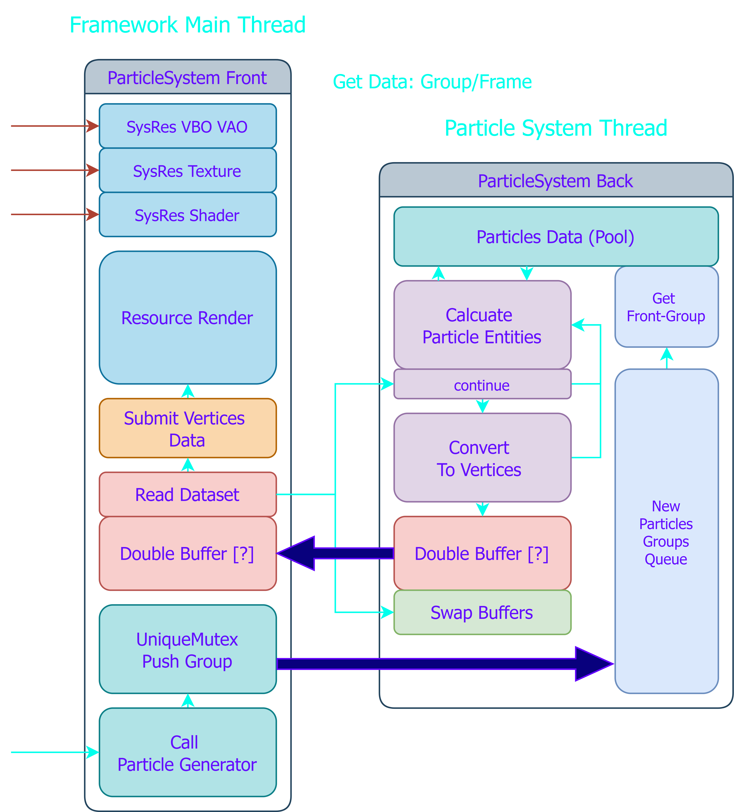
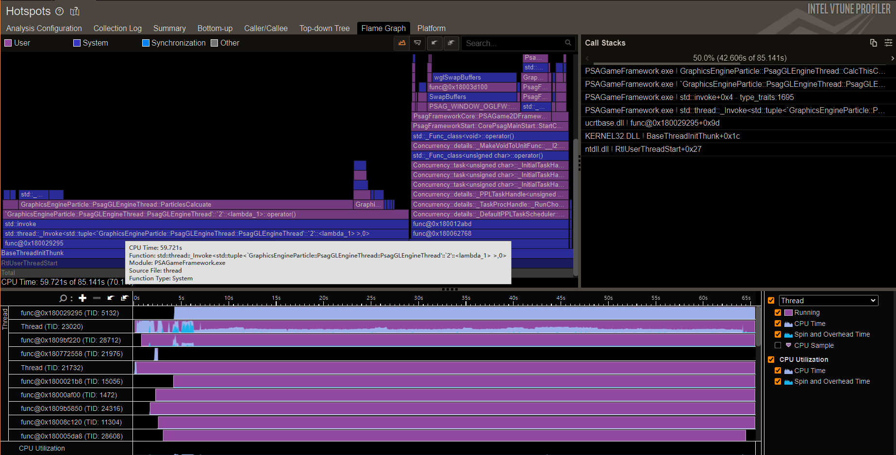
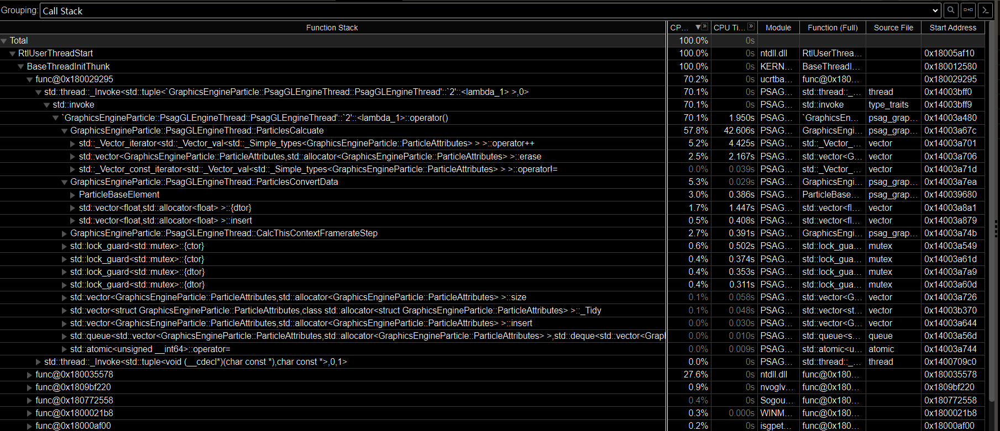
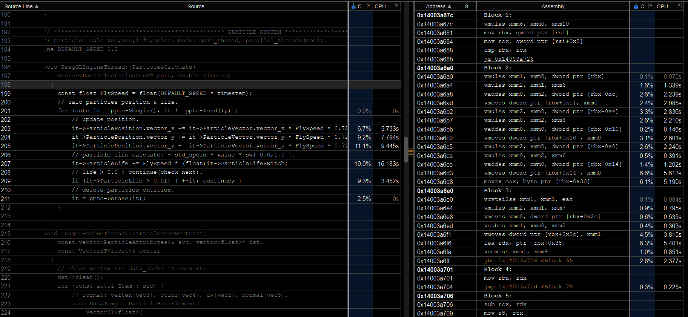

# EXP MOD cpu particle system

> psagame2d framework graph-cpu-particles @rcsz

- __Time:__ 2025.02.26
- __Overview:__ 因为这是一个2D游戏框架, CPU粒子系统作为核心之一也尤为重要, 目前在开发CPU粒子系统遇到了一些, 后台线程与前台粒子系统的性能瓶颈和问题.

---

首先先贴一张 粒子系统 前台/后台 简易架构图 (注意一些细节以及状态采样部分没有绘制进去)

  

> 以下提到框架源码位置仅为 V1.2.7.20250227 版本

前台帧 (游戏帧): FFrame, 后台帧率 (CycleTick): BFrame

1. 因为主线程的负载已经较高, 所以CPU粒子系统方案为 前台绘制-后台计算 的模型, 每个粒子系统实例的实体计算和顶点转换运行在一个独立线程中.
2. 粒子发射部分, 每个发射器一次性创建的粒子数据为Group, 每个Group由前台线程Push给后台队列进行排队, 后台队列中通常会有多个Group排队, 但是每BFrame只会取出一个Group插入到粒子数据集, 实际上也是为了负载均衡考虑, 在每个后台Tick中会根据粒子实体属性进行计算. [SourceFile](../../PSAGameFramework/PSAGameFrameworkCore/CoreFramework/GraphicsEngine/psag_graphics_engine_particle.cpp): `247~253` `292~302`
3. 计算完成后检查前台读取状态, 读取完成后会进行 粒子实体 到 VAO顶点数据格式的数据转换 (EntityToVertex 暂时简称为 ETV), 并且交换数据缓冲区, 如果前台没有读取完成那么依然会进行下一次计算, 但是不会进行 ETV 数据转换. [SourceFile](../../PSAGameFramework/PSAGameFrameworkCore/CoreFramework/GraphicsEngine/psag_graphics_engine_particle.cpp): `215~235` `304~320`
4. 前台读取完成后会修改状态标志通知后台线程进行 ETV 和交换缓冲, 前台数据直接通过框架的底层模块提交渲染, 这里不过多讨论. [SourceFile](../../PSAGameFramework/PSAGameFrameworkCore/CoreFramework/GraphicsEngine/psag_graphics_engine_particle.cpp): `404~410`

- 目前所出现的问题是在粒子发射器发射速度过快 (测试平台中 < 12ms 每轮), 会出现粒子加载堆积形成的延迟问题, 即前台Game事件与粒子实际提交渲染出效果的时间间隔过大.
- 前台与后台帧率波动差值过大, 后台在无粒子状态下甚至能做到 10us/cycles 但是当粒子负载达到4000以上后有接近300倍差值, 之前考虑过做速率限制, 但是一直呈现不规则速率曲线没有较好的方案, 并且 TimeSetp 也需要严格控制.
- 附上一些之前进行 CPU-ParticleSystem 测试的 Intel VTune 测试结果信息. 

其实挺抽象的, 计算线程的 CPU TIME 占了总测试的 70% 时长, 其中粒子计算超过 50%, 也可以看出编译器做出了 SSE 指令集的 SIMD 优化. 当然测试项目 Demo 为压力测试, 不具备太大的实际开发意义.

---

`20250227` `RCSZ`