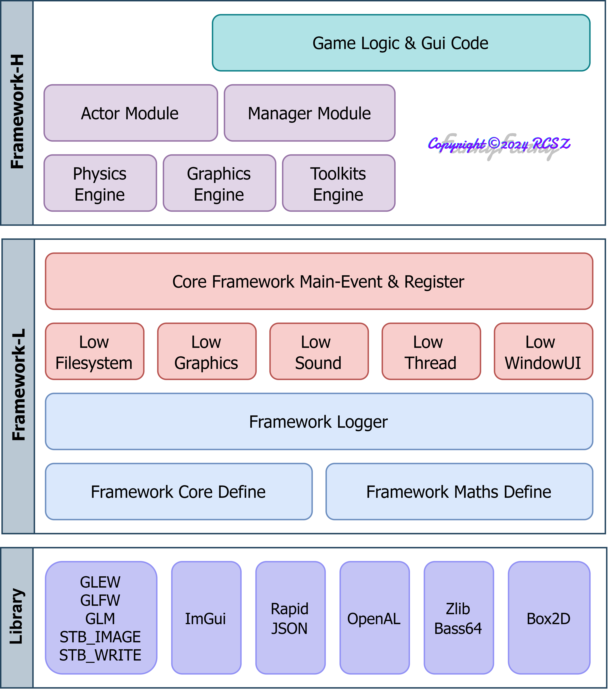
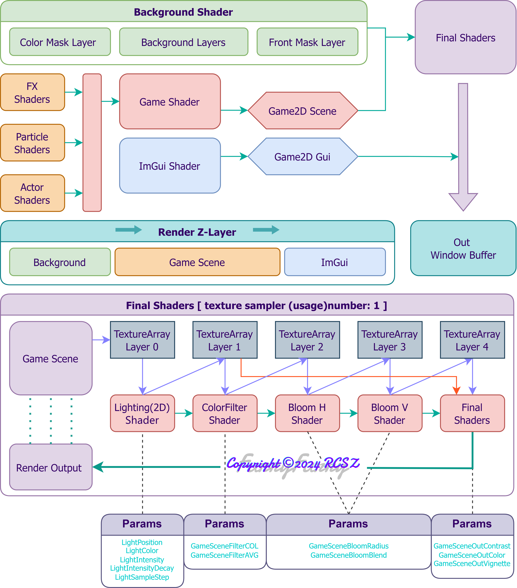
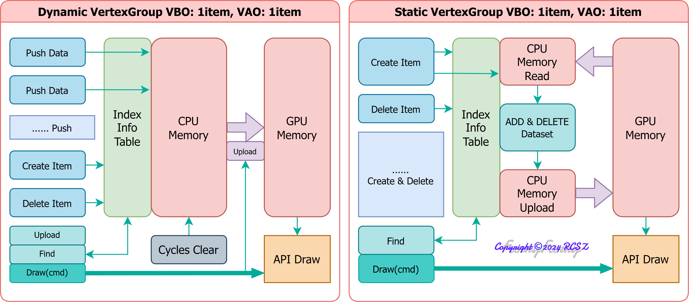
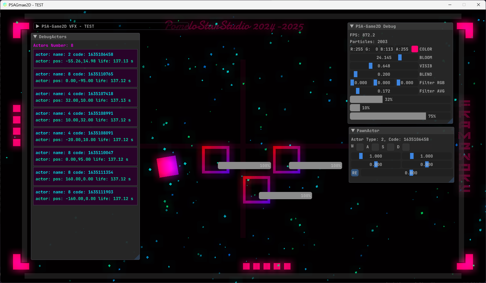

# PSAGame2D
> PomeloStar 2D游戏开发框架.

__当前版本:__ 先行版 v20240607

> 先行版暂无文档, 其实就是工地hhh🙂, 一堆模块还处于开发阶段. ( 希望别弃坑了~~前面还有一堆坑~~

- 图形引擎基于 OpenGL4.6
- 物理引擎基于 Box2D
- 音频模块基于 OpenAL
- 设计理念使用描述符(DESC), 描述各对象以及挂载组件
- 使用简单的控制反转(IOC), 降低代码耦合度
- 框架内置多级背景处理以及多级后期处理着色器组
> 我粗略的学习过ECS, 此设计可能并没有ECS优秀, 只是个人尝试

__开发进度:__ ███████░░░ 72%
> FrameworkCore Files: 64, LoC: 9364
---

## PSAG-ARCH 架构

### 框架层级 & 渲染架构

  
  
  

### 顶点组管理器架构

  

> 架构未完成, 可能还会有微调

## 开发中ing... DebugGUI

> __PS:__ "PSA"是为了致敬咱的工作室PomeloStar, 为什么不是引擎而是框架? 凭我一个菜鸟的实力根本搓不出引擎 (只能是框架
