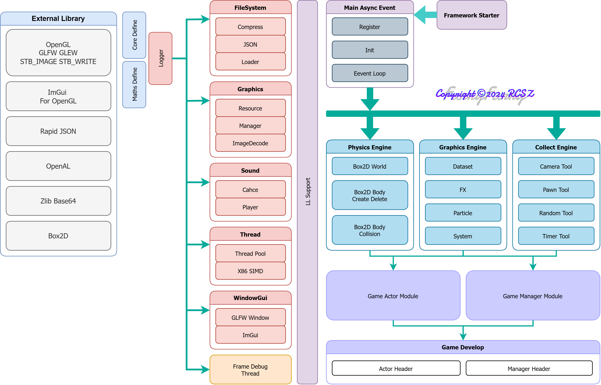
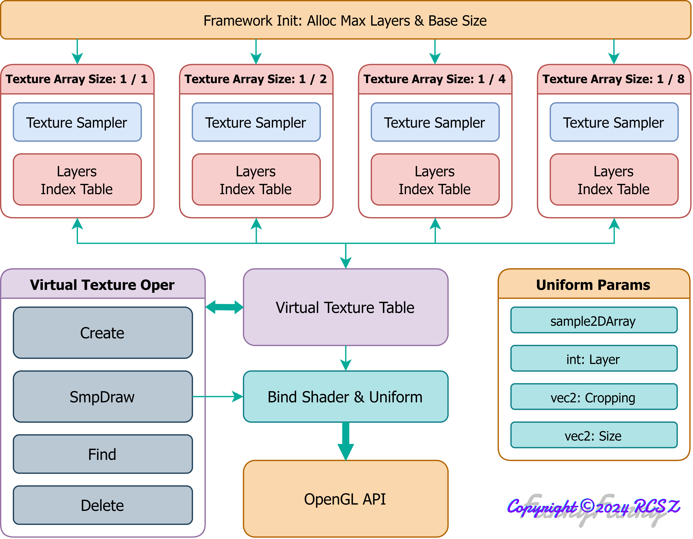
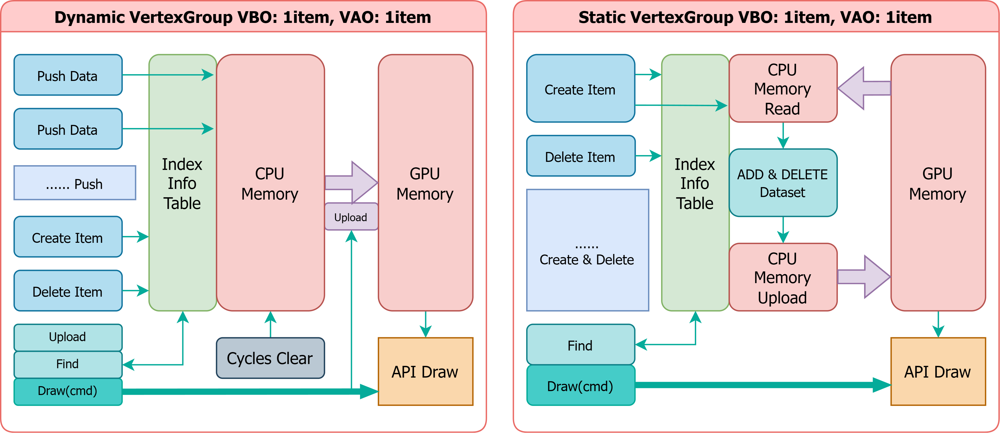
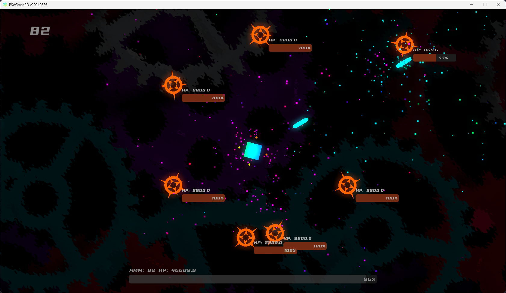

# PSAGame2D
> PomeloStar 2D游戏开发框架.

__当前版本:__ `V1-20240827` __开发文档:__ 暂无(赶工中..ing)

> 目前长期施工中🙂, 许多模块还处于开发阶段. ( 希望别弃坑了~~前面还有一堆坑~~

- 图形引擎基于 `OpenGL4.6`
- 物理引擎基于 `Box2D`
- 音频系统基于 `OpenAL`

目前主要兼容 __WindowsX86__ 平台. 内置帧性能监控, 使用简单的控制反转(IOC), 降低游戏代码与框架的耦合度, 框架内置多级 后期处理&背景处理 着色器管线. 使用描述符(DESC), 描述各构建对象以及挂载组件, 简化手动创建等.

- __开发进度__ __V1:__ `▮▮▮▮▮▮▮▮▮▯` 90%

- __图形引擎重构__ __Vulkan:__ `▮▯▯▯▯▯▯▯▯▯` 5%
> 这可能需要花费一段时间, 趁着当前代码不多, 把整个图形底层全部替换了

FrameworkCore __Files:__ 79, __LoC:__ 11959

---

## PSAG-ARCH 架构

### 架构总览

> 封装后提供调用的游戏构建模块参见: [上层模块表](CALLTABLE.md)

  

### 框架层级 & 渲染架构

  
  
  

### 纹理管理器架构 & 顶点组管理器架构

> 目前顶点组管理器架构, 为避免显存碎片化效率非常低, 以后还会改进.

  
  
  

以上架构并不固定, 可能会有微调.

## 框架每个版本都会带有对应 DEMO

[__BiliBili视频__](https://www.bilibili.com/video/BV1eesneqEmZ/?share_source=copy_web&vd_source=13ed11b7c6628f0aef39803f8e802f5b) __Update:__ 2024.08.27

---

> __PS:__ 能力有限(太菜), PSAGame2D总体为纯代码游戏框架, 目前并不考虑制作图形化编辑器.

项目开坑时间: `2024.03.31`