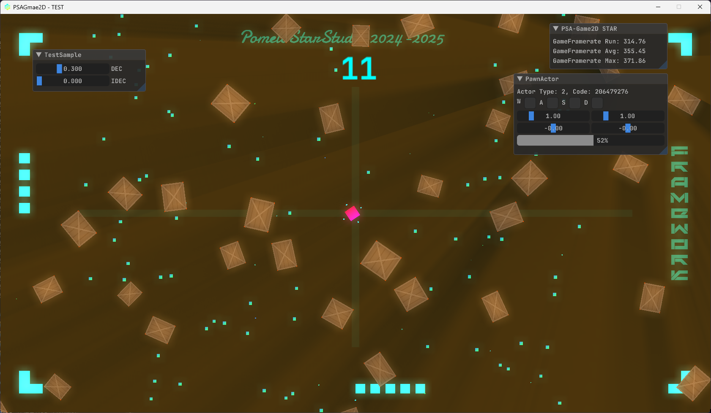

# PSAGame2D
> PomeloStar 2D游戏开发框架.

__当前版本:__ v20240824

> __暂无文档__, 目前还在施工中hhh🙂, 一堆模块还处于开发阶段. ( 希望别弃坑了~~前面还有一堆坑~~

- 图形引擎基于 OpenGL4.6
- 物理引擎基于 Box2D
- 音频模块基于 OpenAL
- 内置帧性能采集器
- 使用简单的控制反转(IOC), 降低游戏代码与框架的耦合度
- 框架内置多级 后期处理&背景处理 着色器管线
- 使用描述符(DESC), 描述各构建对象以及挂载组件, 简化手动创建

__开发进度:__ ████████░░ 89%
> FrameworkCore Files: 79, LoC: 11740
---

## PSAG-ARCH 架构

### 架构总览

> 封装后提供调用的游戏构建模块参见: [上层模块表](CALLTABLE.md)

  

### 框架层级 & 渲染架构

  
  
  

### 纹理管理器架构 & 顶点组管理器架构

  
  
  

> 架构并不固定, 可能会有微调.

## 开发中ing...

[__BiliBili视频__](https://www.bilibili.com/video/BV1VPvoecEux/?share_source=copy_web&vd_source=13ed11b7c6628f0aef39803f8e802f5b)

> __PS:__ "PSA"是为了致敬咱的工作室PomeloStar, 为什么不是引擎而是框架? 凭我一个菜鸟的实力根本搓不出引擎 (只能是框架
