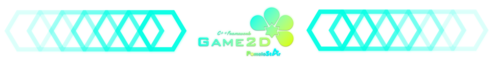
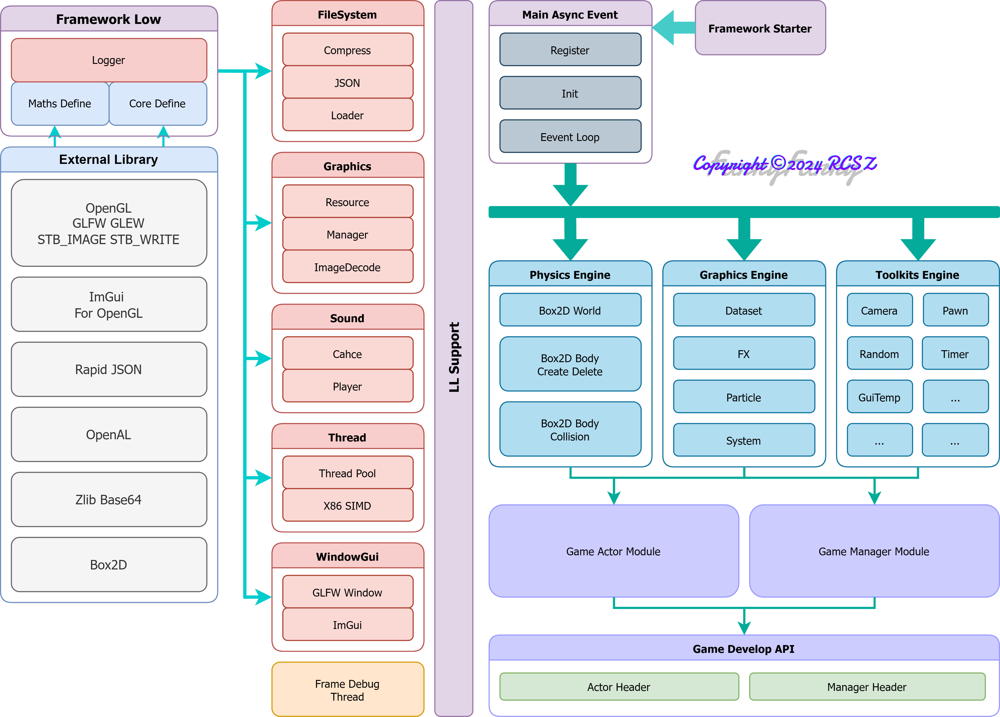
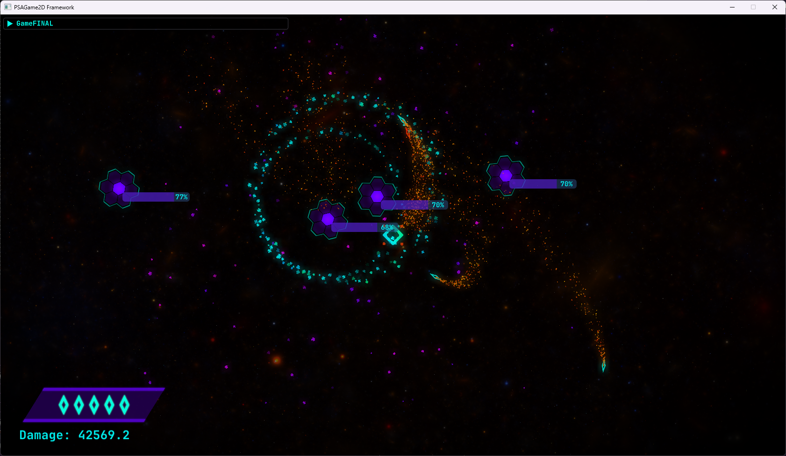

# PSAGame2D
> PomeloStar 2D游戏开发框架.

__当前版本:__ `V1.2.7.20250219` __开发文档:__ 编写中...

> 🚧 目前长期施工中🙂, 并且早期版本并不稳定.



- 图形引擎基于 `OpenGL4.6`
- 物理引擎基于 `Box2D`
- 音频系统基于 `OpenAL`

💻 目前主要兼容 __WindowsX64__ 平台. 内置帧性能监控, 使用简单的控制反转(IOC), 降低游戏代码与框架的耦合度, 框架内置多级 后期处理调色&背景处理 着色器管线. 使用描述符(DESC), 描述各对象构建以及挂载组件, 简化手动配置等.

- __开发进度__ __V1:__ `▮▮▮▮▮▮▮▮▮▯` 92% __底层模块测试完善:__ `▮▮▮▮▮▯▯▯▯▯` 55%

```
FrameworkCore Files: 97 LoC: 15374
FrameworkDemo Files: 15 LoC: 952
```

---

## PSAG-ARCH 架构

### 架构总览

> 封装后提供调用的游戏构建模块参见: [上层模块表](CALLTABLE.md)

<p align="center">
  
</p>

### 框架层级 & 渲染架构

<p align="center">
  
   <span style="display:inline-block; width:1%;"></span>
  
</p>

### 纹理管理器架构 & 顶点组管理器架构

> 目前顶点组管理器架构, 为避免显存碎片化效率非常低, 以后还会改进.

<p align="center">
  
  <span style="display:inline-block; width:1%;"></span>
  
</p>

⚠ 以上架构并不固定, 可能会有微调.

---

### 框架每个版本都会有对应 DEMO 小游戏

[__📺BiliBili视频__](https://www.bilibili.com/video/BV17QfmYSENT) __Update:__ 2025.01.30
> 🎮🎮🎮 __DemoGame:__ ZeroProject



---

> __PS:__ 能力有限(太菜), PSAGame2D总体为纯代码游戏框架, 目前并不考虑制作图形化编辑器.

项目开坑时间: `2024.03.31`